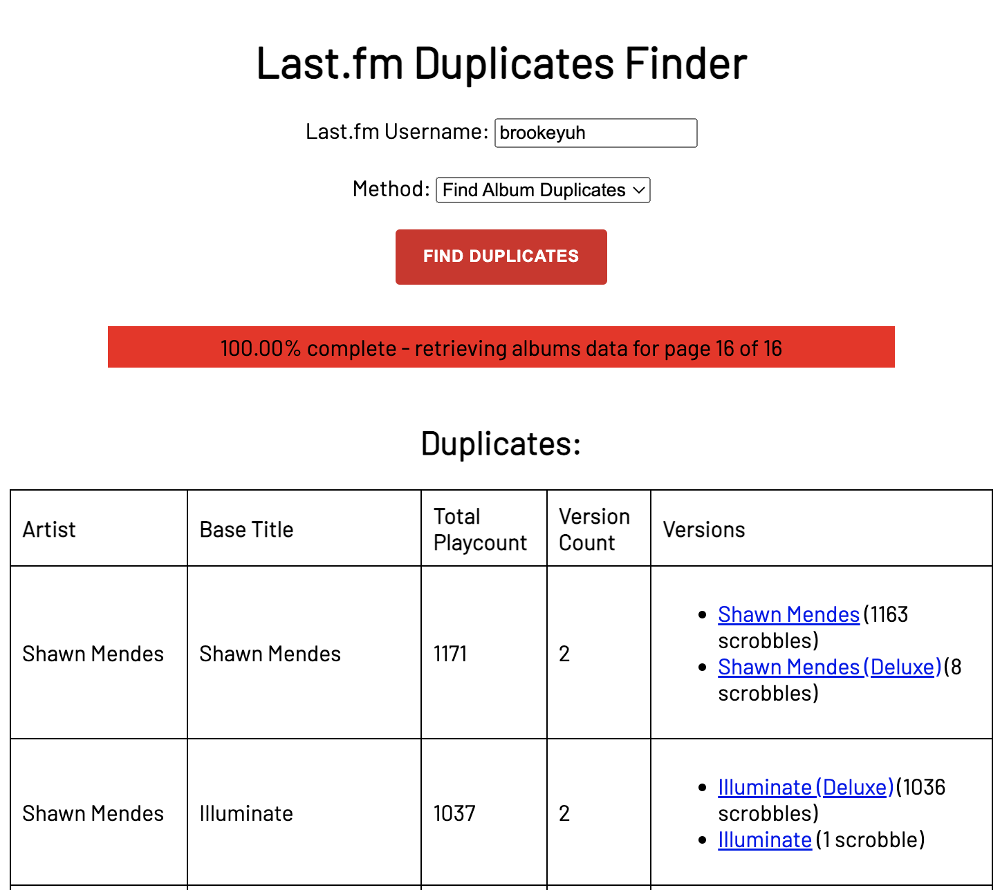

# last.fm dupe finder

---

Simple web app used to identify potential track or album duplicates in your last.fm library. 

Those of us deranged enough to record every song we've ever listened to know the drill: deluxe albums, 15-year anniversary editions, remasters, (Taylor's Version)'s... we know it's all the same, but last.fm does not.

Enter **last.fm dupe finder**. Just type in your username and this app will look through your entire library and display a table full of all the duplicates you have, along with handy links to go edit them yourself.

---

### 🏃 Running app
1. Clone the repo: `git clone https://github.com/brookeknowles/lastfm-dupe-finder.git`
2. Navigate to project `cd lastfm-dupe-finder`
3. Install Node dependencies `npm install`
4. Compile TypeScript & run app `npx tsc && npm start`
5. Open up your favourite browser at http://localhost:3000/

---

### 🚧 Roadmap
- Ability to edit the scrobbles automatically within app
- Make website less ugly?